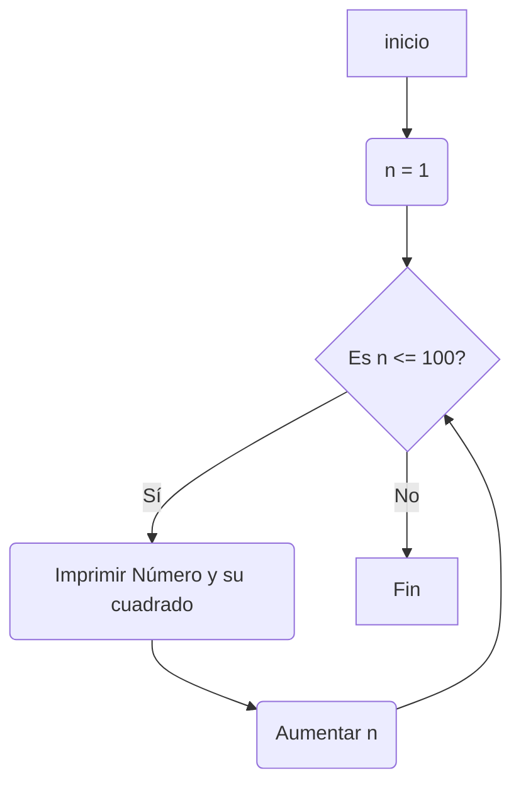
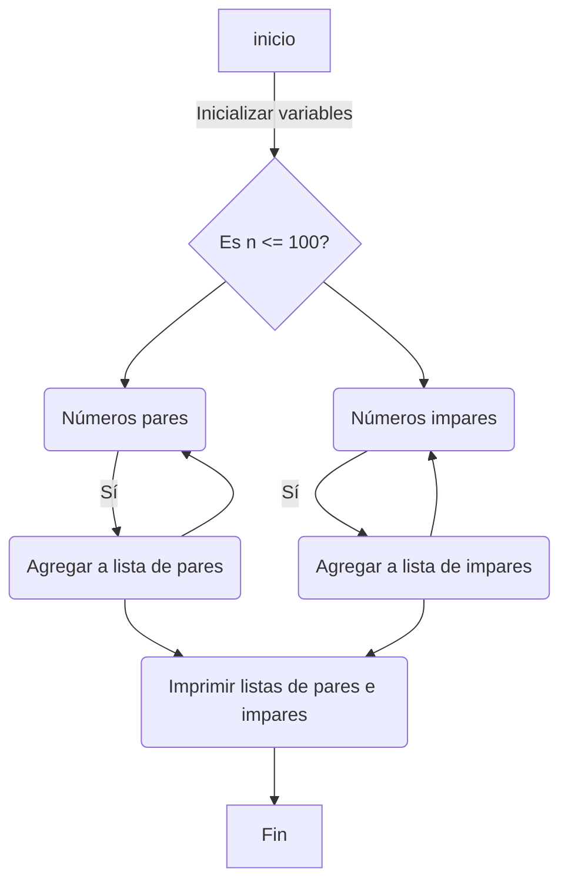
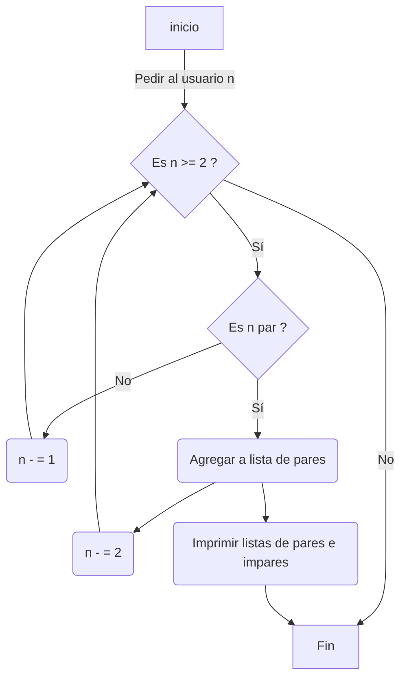

# Reto No. 7:  Bucles 1, el señor "While"
Desarrolle de manera individual la mayoría de ejercicios en clase. Para cada punto cree un programa individual, asimismo cree un notebook con la solución a todos los problemas. 
Los tres primeros puntos deben incluir diagrama de flujo.
Nota: Todo el código de aquí en adelante debe ir debidamente documentado.

1. Imprimir un listado con los números del 1 al 100 cada uno con su respectivo cuadrado


```python
n : int = 1           # inicializa la variable n en 0
while (n <= 100) :    # mientras n sea menor o igual a 100
   print("El número " + str(n) + " elevado al cuadrado es " + str(n**2) ) # imprime el resultado del cuadrado de n
   n +=1              # incrementa el valor de n en 1

```


   
2. Imprimir un listado con los números impares desde 1 hasta 999 y seguidamente otro listado con los números pares desde 2 hasta 1000.


```python
pares = []          # crea una lista vacía para los números pares
impares = []        # crea una lista vacía para los números impares
n : int = 1         # inicializa la variable n en 0
while (n <= 1000) : # mientras n sea menor o igual a 1000
    if n % 2 == 0 : # si el residuo de la division es igual a 0 es par
         pares.append(n)
    else:
        n % 2 != 0  # si el residuo de la division no es igual a 0 es impar
        impares.append(n)
    n +=1           # incrementa el valor de n en 1

print("Los números pares hasta 1000 son: " + str(pares)) # imprime la lista de pares
print("Los números impares hasta 1000 son: " + str(impares)) # imprime la lista de impares
```



3. Imprimir los números pares en forma descendente hasta 2 que son menores o iguales a un número natural n ≥ 2 dado


```python
pares = []          # Crea una lista vacía para los números pares
n = int(input("Ingrese un número natural mayor o igual a 2: ")) # Declara e inicializa variable con valor dado por el usuario
# Imprime los números pares en forma descendente hasta 2
while n >= 2:       # Mientras que n sea mayor o igual a 2
    if n % 2 == 0:  # si el modulo de n es igual a 0 es par
        pares.append(n) # Se agrega a la lista de pares
        n -= 2      # se actualiza la variable disminuyendola de 2 en 2
    if n % 2 != 0:  # si el modulo de n no es igual a 0 es impar
        n-=1        # se le resta 1 para volverlo par
print("Los números pares ordenados de forma descendente: " + str(pares)) # Imprime la lista pares en forma descendente hasta 2
```
   



4. En 2022 el país A tendrá una población de 25 millones de habitantes y el país B de 18.9 millones. Las tasas de crecimiento anual de la población serán de 2% y 3% respectivamente. Desarrollar un algoritmo para informar en que año la población del país B superará a la de A.


```python
poblacionA = 25000000   # Población inicial del país A
poblacionB = 18900000   # Población inicial del país B
tasaA = 0.02          # Tasa de crecimiento anual del país A
tasaB = 0.03          # Tasa de crecimiento anual del país B
year = 2022           # Año inicial

while poblacionB <= poblacionA:      # Mientras la población del país B sea menor o igual que A
    poblacionA *= ( 1 + tasaA )      # Se suma la cantidad de personas segun la tasa de crecimiento anual
    poblacionB *= ( 1 + tasaB )      # Se suma la cantidad de personas segun la tasa de crecimiento anual
    year += 1                        # Aumenta el año
    
print(f"La población del país B superará al país A en el año {year} con una población " + str( poblacionB ) + " Vs. una población de " + str( poblacionA ) + " del país A.") 
# Imprime el año en que la población de B supera a la de A
```
   


5. Imprimir el factorial de un número natural n dado.


```python
n = int(input("Ingrese un número natural: "))  # Declarar e inicializar con el valor dado por el usuario
factorial = 1         # Inicializar la variable factorial en 1
i : int = 1           # Inicializar la variable i en 1
while i <= n:         # Mientras que i sea menor o igual a n
    factorial *= i    # Se multiplica factorial por i cambiando sus valores con cada iteración
    i += 1            # Actualizar i para ir multiplicando por el siguiente numero
print(f"El factorial de {n} es {factorial}")  # Imprimir el factorial de n
```
   


6. Implementar un algoritmo que permita adivinar un número dado de 1 a 100, preguntando en cada caso si el número es mayor, menor o igual.


```python
print("Piense y memorice un número a adivinar entre 1 y 100")  # Información
minimo : int = 1          # Inicializar las variables para la búsqueda  
maximo : int = 100
i : int = 0
while minimo <= maximo:   # Mientras el minimo sea menor o igual que el maximo
    i += 1                # Incrementar el contador de intento
    medio = (minimo + maximo) // 2 # Adivinar el número medio del rango actual redondeado hacia abajo
    respuesta = input(f"¿Es {medio} el número? (s/n) ")
    
    if respuesta == "s":  # Actualizar el rango de búsqueda según la respuesta
        print(f"¡Adiviné el número en {i} intentos!")
        break
    elif respuesta == "n":
        respuesta = input(f"¿Es el número mayor o menor que {medio}? (Digite 1=Mayor o 2=Menor) ")
        if respuesta == "1":
            minimo = medio + 1
        elif respuesta == "2":
            maximo = medio - 1
        else:
            print("Respuesta inválida, intente de nuevo.")
    else:
        print("Respuesta inválida, intente de nuevo.")
```
   


7. Implementar un programa que ingrese un número de 2 a 50 y muestre sus divisores.


```python
n = int(input("Ingrese un número de 2 a 50: ")) # Declarar e inicializar con el valor dado por el usuario
i : int = 1          # Inicializar la variable i en 1
while i <= n :       # Mientras i sea menor o igual n
    if n%i == 0 :  # Si n es divisible por i su residuo es igual a 0
        print(f"{i} es divisor de {n}")   # Imprimir i
    i +=1          # Actualizar i en 1 más
```
   


8. Implementar el algoritmo que muestre los números primos del 1 al 100. Nota: use funciones.


```python
def esPrimo(n):
    if n < 2:     # Si el número es menor que 2, no es primo
        return False
    i = 2         # Inicializa i en 2 ( i es el divisor )
    while i <= n**(0.5): # Mientras el divisor sea menor o igual que la raíz cuadrada de n
        if n % i == 0:   # Si el número es divisible por el divisor actual
            return False # El número no es primo
        i += 1           # Incrementar en 1 el divisor
    return True          # Si algún divisor lo divide, el número es primo

if __name__ == "__main__":
    n = 1                # Inicializa n ( primer número a comprobar ) 
    while n <= 100:      # Mientras el número sea menor o igual a 100
        if esPrimo(n):   # Si el número es primo ( se llama a la funcion esPrimo)
            print(n , end=", ") # Imprime el número en la misma línea, separado por una coma
        n += 1           # Incrementa el número a comprobar en 1 para pasar al siguiente
```
   

